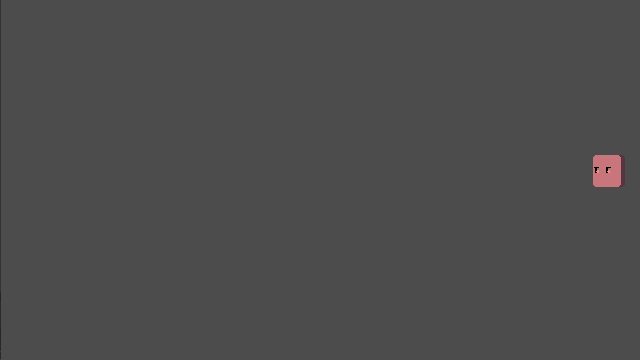
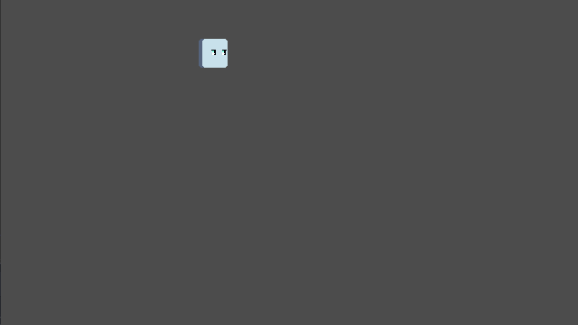

# A beginning
This file is mainly made as a form of guidance for myself after tackling several shmup games *(Ranging from simple jam entries in the spirit of simple shmups akin to Space Invaders and 1942 and more advanced shmups)* in attempt to understand how a basic enemy unit can be designed, and what cliches can be found in common between said games.

# Let's get into it
An enemy can be divided into 3 phases:
1. Intro
2. Action
3. Departure

## Intro attributes

| Name | Description |
| :-------------: | ------------- |
| **None** | The enemy simply moves into the scene, getting instantly into the *action* phase.       *A forward moving enemy, no intro animation* |
| **Tween to position** | The enemy tweens into a specific position, usually accompanied by being instantiated in other spots of the screen and different types of tweening to provide interesting effects.       *An enemy tweening to position, linear interpolation and easing in-out* |
| **Foreground animation** | The enemy has an animation, usually scaling down if coming from the foreground, disabling its hitbox through the animation.       *An enemy coming from the foreground, done with 2 tweens* |
| **Teleport** | The enemy has a teleportation animation before being instantiated/spawned in place of the animation. |

## Action attributes
The action attributes are split into two types:
1. Movement attributes
2. Shooting attributes
The types can be either simultaneous, or focused on one of the types.

### Movement attributes

| Name | Description |
| :-------------: | ------------- |
| **Straight line** | The enemy moves in a straight line. Can be either of a moderate speed, the background’s scrolling speed *(if the enemy is part of the ground/stationary)* or slow to imply heaviness. *(for bullet sponges and bomb-types)*       *An enemy moving in a straight line* |
| **At player** | The enemy moves in the player’s direction, similar speed traits as the straight line variant. |
| **Sinewave** | The enemy moves in a sine wave vertically while having normal horizontal movement. Multiples can be used to create interesting shapes. *(Wave, reverse sine)*       *Enemies moving in a sine wave, one then multiple* |
| **Zigzag** | The enemy moves forward then up and back before continuing forward to resemble a zigzag shape.       *An enemy moving in a downwards zigzag* |
| **Dash** | The enemy moves in a bigger speed than a regular enemy, usually combined with an intro. |
| **Repositioning** | The enemy moves around a set of predefined spots. Can be combined with shooting projectiles after moving through such spots or during every movement.       *An enemy repositioning across various spots, shooting after stopping at selected times* |
| **Hovering** | The enemy moves around the scene slowly, usually used for bigger enemies or bosses to stop them from being completely stationary.       *The closest approximation to such a behavior with a small enemy* |

### Shooting attributes

| Name | Description |
| :-------------: | ------------- |
| **Straight line** | The enemy shoots a projectile *(or a cluster)* that moves forward.       *An enemy shooting forward* |
| **At player** | The enemy shoots a projectile *(or a cluster)* that moves in the player’s direction.       *An enemy shooting a cluster in the player’s direction* |
| **Spread shot** | The enemy shoots more than one projectile at once, spread to shape an arc. The arc’s main angle can be either a forward line, or in a specific direction. *(ie. the player’s)*       *An enemy shooting 3 projectiles* |
| **Spraying** | The enemy scatters multiple projectiles *(or clusters)* with a brief gap between each projectile, akin to using a machine gun to spray bullets.       *An enemy spraying 5 projectiles* |
| **Radial blast** | The enemy shoots projectiles spread in the shape of a circle at once. Changing angles between blasts can provide an interesting challenge *(used in danmakus/bullet hell games)*       *An enemy shooting 10 projectiles in a circle* |
| **Charging (Special)** | The enemy takes a moment to charge before blasting multiple shots, one after another. The projectile style can be any of the attributes discussed above. |
| **Bomb  (Special)** | The enemy triggers the shots like a bomb when killed, usually using a radial blast. |

## Departure attributes

| Name | Description |
| :-------------: | ------------- |
| **None** | The enemy continues with the *action* phase, usually found in *movement*-focused enemies. |
| **Movement** | The enemy uses one of the *movement* attributes as a way to leave the scene, usually used after a *shooting* attribute/phase that takes a longer time. |
| **Disappearing** | The enemy has another teleportation animation to leave the scene, which can be used as a way to reward the player for quickly defeating the enemy before disappearing. |

# References
I was heavily inspired by Garret Bright’s [Build a Bad Guy Workshop article](https://www.gamedeveloper.com/design/build-a-bad-guy-workshop---designing-enemies-for-retro-games) and how he structured the article, definitely worth a read.
I played:
- [Twin Strike](https://www.lexaloffle.com/bbs/?tid=43453) *(pico8 game)* by Mikesta
- [Warwind](https://louiechapm.itch.io/warwind) *(pico8 game, jam entry)* by LouieChapm
- [ZeroRanger](https://se-made.com/zeroranger.html) *(Demo)* by System Erasure
- Lords of Thunder *(Sega CD)* by Red Entertainment/Hudson Soft
- Gunbird 1 and 2 *(Arcade, Sega Dreamcast)* by Psikyo

I watched the playthroughs of:
- [Star Soldier R](https://www.youtube.com/watch?v=yZRBxNcLQuk) *(Wiiware)* by Hudson Soft
- [Darius Twin](https://youtu.be/9OjfHqxdNjA) *(SNES)* by Taito
